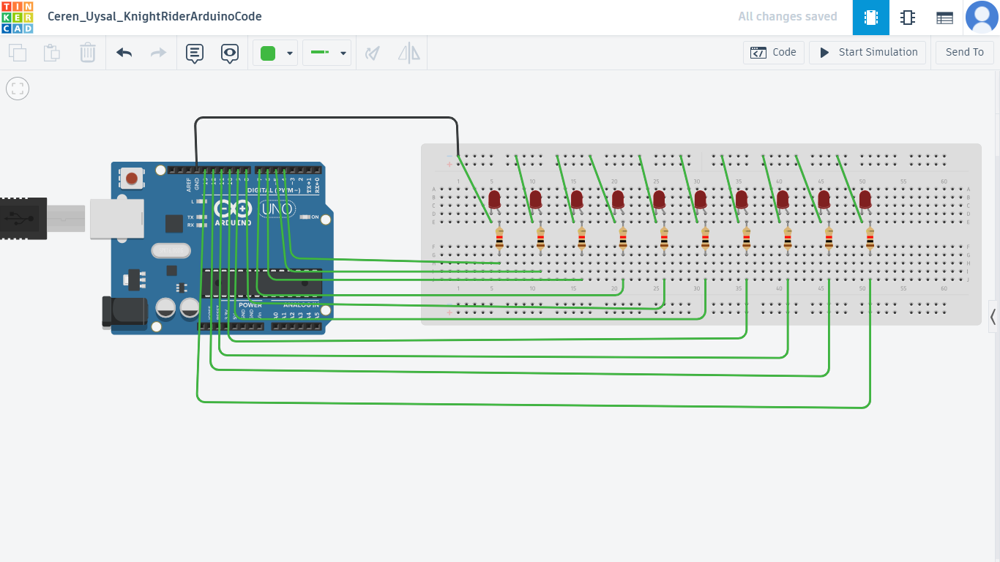

# Knight Rider Arduino Project

Arduino Knight Rider LED effect using multiple LEDs.
This project simulates the Knight Rider LED effect using Arduino.

## Components
- Arduino Uno
- LEDs
- Resistors
- Breadboard

## How it works
LEDs turn on sequentially from left to right and then reverse.

## Note
This project is inspired by online Arduino Knight Rider examples.
I recreated and tested it on Tinkercad for learning purposes.

## Circuit Design



## Code

```cpp
// Knight Rider LED effect
int leds[] ={4,5,6,7,8,9,10,11,12,13};
int size = 10;

void setup(){
  for(int i=0; i<size; i++){
    pinMode(leds[i], OUTPUT);
  }
}

void loop()
{
  for(int i=0; i<size; i++){
    digitalWrite(leds[i], HIGH);
    delay(100);
    digitalWrite(leds[i], LOW);
  }
  
  for(int i=size-2; i>0; i--){
    digitalWrite(leds[i], HIGH);
    delay(100);
    digitalWrite(leds[i], LOW);
  }
}
```

## Simulation
Built and tested using Tinkercad.

## Author
Ceren Uysal
